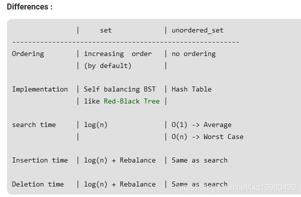
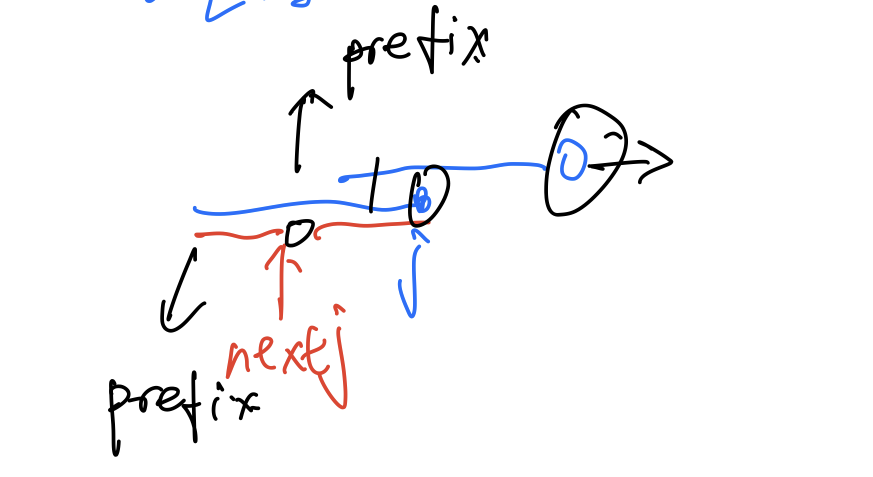
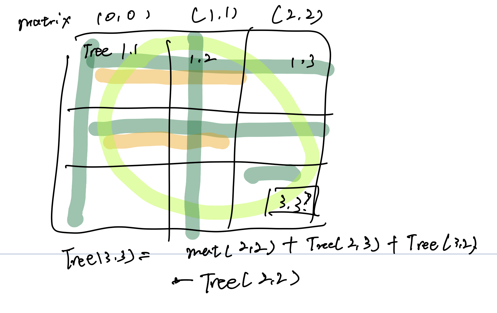
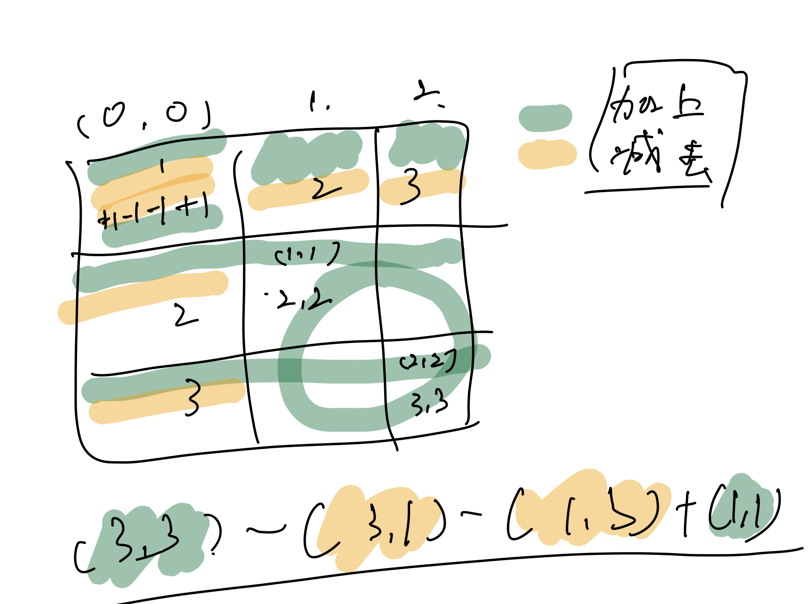

# 记录

------

[TOC]


### 21/4/18


#### Leetcode 220 重复元素: 

https://leetcode-cn.com/problems/contains-duplicate-iii/

#### <font color='red'>set | unorderedset</font> 

```c++
set<int> set_test;//支持二分查找, 插入 删除
set_test.lower_bound(begin, end, num);//找到set内部第一个 大于或等于num的值的位置 没有符合条件的则找到set_test.end();
set_test.upper_bound(begin, end, num);//找到set内部最后一个 大于num的值的位置
set_test.insert(num);//插入一个
set_test.erase(num| iterator)//根据数值或者 地址来删除
    //set -> 顺序存储 unorderedset ->非顺序存储(hash表)
    
```

set 用于优化 <font color='green'>滑动窗口</font> (二分查找 可以让时间从$n^2$ 降到 $nlog(n)$)




### 4/19

#### Leetcode 27 移除数组

https://leetcode-cn.com/problems/remove-element/

#### 双指针

通过维护左右两个指针, 完成对数组内部值的筛选.

左指针做结果记录, 右指针进性遍历.

##### 4/29 双指针的实质

https://leetcode-cn.com/problems/sum-of-square-numbers/solution/shuang-zhi-zhen-de-ben-zhi-er-wei-ju-zhe-ebn3/


#### LC 28 字符串匹配

https://leetcode-cn.com/problems/implement-strstr/

#### kmp算法

通过记录匹配串中<font color='red'>字串</font>的前后缀匹配长度来改变当前位置不匹配时， 下一次的开始匹配位置

##### next 数组(双指针?)

$model : adgihaofdjoasdifjoasdij$

$pattern: a, b, a, b, a, c, a$ -> 构造$next$

(-1 代表 不存在匹配前后缀, 0表示<font color='red'>前后缀匹配长度</font>为 1, 1 $means$2...)

| 位置       | next[0] | 1    | 2    | 3    | 4     | 5      | 6       |      |
| ---------- | ------- | ---- | ---- | ---- | ----- | ------ | ------- | ---- |
| 部分字符串 | a       | ab   | aba  | abab | ababa | ababac | ababaca |      |
| 位置       | -1      | -1   | 0    | 1    | -1    | 0      | 1       |      |

|                                            | 直接跳过(0) | 1    | 2                                 | 3                                 | 4    | 5    | 6    |
| ------------------------------------------ | ----------- | ---- | --------------------------------- | --------------------------------- | ---- | ---- | ---- |
| $i$ :<font color='red'>后缀位置</font>     | 0           | 1    | 2                                 | 3                                 | 4    | 5    |      |
| $j + 1$(<font color='red'>在判断时</font>) | 0           | 0    | 0<font color='red'>(a = a)</font> | 1<font color='red'>(b = b)</font> | 2    | ?    |      |
| $j$ : <font color='red'>前缀位置</font>    | -1          | -1   | 0                                 | 1                                 | 2    | ?    |      |
| next[i]                                    | -1          | -1   | 0                                 | 1                                 | 2    | ?    |      |
|                                            | a           | b    | a                                 | b                                 | a    | c    | a    |


```c++
void  get_next(string str, vector<int> next){
    next[0] = -1; int n = next.size();
    int j = - 1;
    //第一位不用判断
    for(int i = 1; i < n; i++){
        while(str[i] != str[j + 1] && j >= 0){
            j = next[j];
        }
        if(str[i] == str[j + 1]) j++;
        next[i] = j;
    }
}
```

**保证下一步匹配的前缀和后缀，只有最后一位不相同即可。**

for循环 到$ i = 5$  此时str中 $ c!= a$ 在  $j$ 处回溯, 

因为 由于此时 $next[5] = c$ 与 $next[2] = a$ 不等 , 而 $next[i - 1]$ (即<font color='red'>前一位的前后缀匹配长度</font>)已知 需要在<font color='red'>前一位子串中</font>找 <font color='red'>匹配位置</font> 的<font color='green'>下一项</font>, 即可回溯. 

当j = - 1 时说明不存在前后缀匹配了, 判断与初始位置是否相同后赋值即可.

**不断回溯找前缀的 后一位 比较**




### 4.22 前缀和

#### LC [303. 区域和检索 - 数组不可变](https://leetcode-cn.com/problems/range-sum-query-immutable/)(一维前缀)

**前缀和   :  **$Sum_{n} = Sum_{n - 1} + a[n]$

```c++
int prefix[10000]{0}// 从i = 1 开始, 将i = 0 时记为0,简化处理边界条件时判断条件
for(int i = 1; i < nums.size() + 1; i++){
	prefix[i] = nums[i - 1];//
	if(i - 2 >= 0) prefix[i] += prefix[i - 1];
}
```


#### LC [363. 矩形区域不超过 K 的最大数值和](https://leetcode-cn.com/problems/max-sum-of-rectangle-no-larger-than-k/)(二维前缀)

(**将第一(0)行和第一(0)列初始化0**)

```C++
	int tree[1000][1000]{0};//第0行/列初始0, 便于边界计算
    NumMatrix(vector<vector<int>>& matrix) {
        //方法1 求每行一维前缀和, 每列递加
        for(int i = 1; i <= matrix.size() ; i++){
            int s = 0;
            for(int j = 1; j <= matrix[0].size(); j++){
                s += matrix[i - 1][j - 1];
                tree[i][j] = tree[i - 1][j] + s;
            }
        }
    }
	//方法2
    int tree[1000][1000]{0};
    NumMatrix(vector<vector<int>>& matrix) {
        for(int i = 1; i <= matrix.size() ; i++){
            for(int j = 1; j <= matrix[0].size(); j++){
                tree[i][j] = matrix[i - 1][j - 1] + tree[i - 1][j] + tree[i][j - 1] - tree[i - 1][j - 1];//图解
            }
        }
    }
```

方法2 图




**求目标区域函数**

```c++

int sumRegion(int row1, int col1, int row2, int col2) {
   int res = 0;
   res = tree[row2 + 1][col2 + 1] - tree[row1][col2 + 1] - tree[row2 + 1][col1] + tree[row1][col1];
    return res;}
```

解法 图




#### LC [304. 二维区域和检索 - 矩阵不可变](https://leetcode-cn.com/problems/range-sum-query-2d-immutable/)(二维前缀, 遍历优化)

题目描述 :给你一个 m x n 的矩阵 matrix 和一个整数 k ，找出并返回矩阵内部矩形区域的不超过 k 的最大数值和。

题目数据保证总会存在一个数值和不超过 k 的矩形区域。

来源：力扣（LeetCode）

**思考: 遍历, 变上下, 从左向右搜索矩形(若面积恒$S >= 0$ 则可设置剪枝条件) **

由于 Sr - Sl < k, Sr不断变化, 可以考虑 Sr - k < Sl 找已经存下的 Sl 满足条件的, 此处可以用二分搜索优化, 最后复杂度$m^2*nlog(n)$;

### 4.23 动态规划

#### [368. 最大整除子集](https://leetcode-cn.com/problems/largest-divisible-subset/)

给你一个由 无重复 正整数组成的集合 nums ，请你找出并返回其中最大的整除子集 answer ，子集中每一元素对 (answer[i], answer[j]) 都应当满足：
answer[i] % answer[j] == 0 ，或
answer[j] % answer[i] == 0
如果存在多个有效解子集，返回其中任何一个均可。

来源：力扣（LeetCode）

**思路 :**   将 小 的整除子集, <font color='red'>扩充</font> 为最大整除子集(不需要保存数组)

​			如何扩大? <font color='red'>整除子集有性质</font>: $a \% b = 0, b\% c = 0$则$a \% c = 0$

​			即可使用动态规划的思想对$nums[i]$中所有整数求出最大整除子集:

**初始化**

首先对$nums$排序, 使其变为升序序列.

维护一个长度为nums.size()的序列 ​v[len]​, 由于每个整数都可以整除本身, 所以$v$初始化为1;

对于递增的每个数值nums[i] ,遍历nums[j] (j in \{0 ~ j\}), 如果$nums[i] $可以整除 $nums[j]$

则根据<font color='red'>整除子集的性质</font>可以判断nums[i]​ 也可以整除内的所有子集,


$$
v[i] = max\{\ v[i], max\{\left.\begin{matrix} 
   nums[i] \% nums[j] == 0\\ j \in \{0 \sim i-1  \}
  
\end{matrix}\right\} nums[j] \}\ + 1 \  \}
$$
(满足了动态规划的<font color='brown'>无后效性</font> 我也不懂啥意思 ,但是根据思路, 不管先前的整除子集是啥, 该位置的整除子集数量是固定的, 且当数组向后滚动时均满足性质, 殊途同归)

动归复杂度$n^2$

**结果输出**

记录下所得的最大子集长度$mx$与位置p

将$nums[p]$放入输出数组内, $mx = mx - 1$ 来找$nums[p]$的最大整除解

由数组该位置**倒序遍历**

当<font color='red'>$nums[p]\  \% \ nums[i] == 0 \&\& mx == v[i]$</font>即找到一个最大整除解(题目支持 多个符合条件结果)

将$nums[i]$ push入, $p = i, mx--$ 当mx =0 即找完; 

### Sort() in descentant order(5/ 20)

```c++
// C++ program to demonstrate descending order sort using
// greater<>().
#include <bits/stdc++.h>
using namespace std;
  
int main()
{
    int arr[] = { 1, 5, 8, 9, 6, 7, 3, 4, 2, 0 };
    int n = sizeof(arr) / sizeof(arr[0]);
  ///////////////
    sort(arr, arr + n, greater<int>());
  ///////////////
    cout << "Array after sorting : \n";
    for (int i = 0; i < n; ++i)
        cout << arr[i] << " ";
  
    return 0;
}
```

### Priority_queue ->Cmp

Priority_queue template

```c++
template <
   class Type,
   class Container=vector<Type>,
   class Compare=less<typename Container::value_type> >
class priority_queue
```

方法1

```c++
//使用结构体(类)然后再类内重构 '<'
struct pp{
    int a;
    string str;
    pp(int x, string st):a(x), str(st){}
    bool operator< (pp b) const{
        return a < b.a;
    }
    ///
    bool myCmp(pp b){
        return ...
    }
    ///
};
int main() {
    vector<int> nums{14,70,53,83,49,91,36,80,92,51,66,70};
    Solution s;
    map<string, int> dic;
//    for(int i = 0; i < 3; i++){
//        pair<string ,int> tem;
//        cin>>tem.first>>tem.second;
//        dic[tem.first] = tem.second;
//    }
    priority_queue<pp, vector<pp> (,myCmp)> ppq;
    for(auto i : nums){
        pp tem(i, "a");
        ppq.push(tem);
    }
    while(!ppq.empty()){
        cout<<ppq.top().a<<' ';
        ppq.pop();
    }
    return 0;
}
```

方法二

```c++
//使用仿函数方法 重构操作符()
struct cmp{
    bool operator () (const pair<string, int> &a, const pair<string, int> &b) {
        if (a.second != b.second) return a.second > b.second;
        return a.first < b.first;
    }
};
......
    priority_queue<pair<string, int>, vector<pair<string, int>>, cmp> que;
.....
```

方法三

```c++
//使用lambda
auto cmp = [](pair<string, int>a, pair<string, int> b){
	if(a.second != b.second) return a > b;
	return a.first < b.first;
};
//decltype(cmp) -> declare type?
priority_queue<pair<string, int>, vector<pair<string, int>>, decltype(cmp)> que(cmp);
```

#### Find the Kth(largest or smallest) Number

对于前 kk 大或前 kk 小这类问题，有一个通用的解法：**优先队列**。优先队列可以在 O(\log n)O(logn) 的时间内完成插入或删除元素的操作（其中 nn 为优先队列的大小），并可以 O(1)O(1) 地查询优先队列顶端元素

```

```

